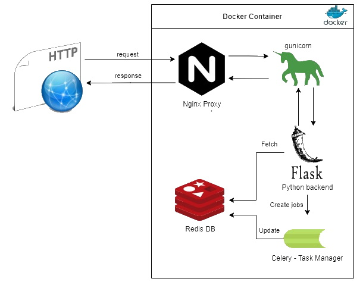

# Text Insight

A web service used to extract and report word count.  
**_NOTE:_** Currently support **UTF-8** and tested with **English**

## Overview
  

## How to Use
### Tools
#### [Docker](https://www.docker.com/products/docker-desktop)
Docker is used to simplify and ease the use of this web service
(please make sure you have Docker installed)
#### [Httpie](https://httpie.io/#installation)
A great tool, used in the testing script and generally very recommended
### Build & Run
Use the provided script `build_and_run.sh`   
(Alternatively you can build and run it yourself, or use the `main.py` script for debugging)
### Testing
Use the provided script `run_test.sh` (See [sample](./images/test_sample.png))

## Web Service API
The web service listen on port 5000 and support the following endpoints:
### ping
_GET /api/v1/ping_  
Simple ping request, respond with "pong" 
### upload
_POST /api/v1/upload_  
Basic upload used to work with local files (mainly for testing)  
Example:  
`http --form POST <server-ip>:5000/upload file@./tmp/file.txt`
### word_counter
_POST /api/v1/word_counter?type=<input_type>?input=<input_date>_   
Receives a text input and counts the number of appearances for each word in the input.  
1. The endpoint does not return data (return success status and text) 
2. The endpoint returns immediately after receiving the data (the task is processed by a background job)  

The endpoint accepts input in 3 ways:
* A simple string sent in the request.
* A file path for a file in the server’s filesystem (the contents will be used as input).
* A URL (the data returned from the URL will be used as input).
#### Input Types
| type | example |
|---|---|
| string | `http POST <server-ip>:5000/word_counter type=='string' input=="Hi! My name is (what?), my name is (who?), my name is Slim Shady"`  |
| path | `http POST <server-ip>:5000/word_counter type=='path' input=="file.txt"`  |
| url |  `http POST <server-ip>:5000/word_counter type=="url" input=="https://www.site.com/file.txt"` |

### word_statistics
_GET /api/v1/word_statistics/\<word>_  
Receives a word and returns the number of times the word appeared so far (in all previous
inputs).  
Example:  
`http <server-ip>:5000/word_statistics/amazing` (this will return the count for the word "amazing")

## Notes
### Assumptions
* We are only dealing with **text files** that are **encoded in utf-8** 
* For the URL API, files name is available in the url, for example: "https://site.temp/file.txt"
* This design is using prod config to support many requests but the extent was not fully tested

### Limitations
* Upload API is limited to 200 MB (Can be changed on the nginx conf)

### Future possible enhancements
* Would be cool to add support for txt files that are compressed in zip
* Right now api request get responded immediately, it will be a nice improvement to add a ticketing system, this way we can track the process using another (new) API
